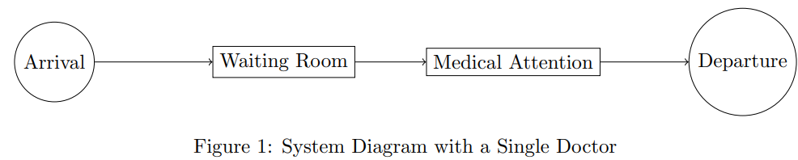
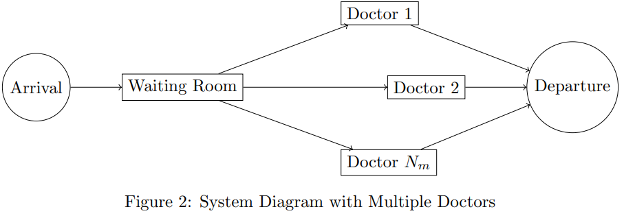

# Hospital system queue simulation

## Conceptual Model of the System

The system to be simulated is a clinic that attends to patients sequentially. Patients arrive at the clinic following a distribution of inter-arrival times, wait in a waiting room if the doctor is busy, and then receive medical attention.

### Variables and Parameters

- **Inter-arrival Time ($T_a$)**: Distribution of the time between patient arrivals.
- **Service Time ($T_s$)**: Distribution of the time it takes to attend to a patient.
- **Number of Doctors ($N_m$)**: Number of available doctors to attend to patients.
- **Waiting Room Capacity**: Assumed to be unlimited for this model.
- **Number of Patients per Simulation ($N_p$)**: 300 patients.
- **Number of Simulations ($N_s$)**: 2036 simulations, calculated using Chebyshev's theorem.
- **Queue Policies**: The customer queue is managed under the FIFO principle, and the event queue is handled by the nearest time on the clock.

### System Diagram with a Single Doctor

### System Diagram with Multiple Doctors

## Design of Relevant Events

The events considered in the simulation are:

- **Arrival**: A patient arrives at the clinic.
- **Service Start**: A patient begins to be attended by a doctor.
- **Departure**: A patient finishes their attention and leaves the clinic.

These events are managed through an event queue prioritized by the time they occur.

## Statistical Analysis of Distributions

Goodness-of-fit tests were conducted to determine the distributions that best model the inter-arrival times and service times.

### Inter-arrival Times

- The following distributions were tested: exponential, gamma, weibull\_min, lognormal, beta, and triangular.
- The **exponential** distribution was the best fit for the inter-arrival times, according to the Kolmogorov-Smirnov test with a high p-value, and the null hypothesis was not rejected.

| Distribution   | KS Statistic | p-value               | Decision        |
|----------------|--------------|-----------------------|-----------------|
| exponential    | 0.045565     | 0.5463812             | Do not reject   |
| gamma          | 0.051585     | 0.3886398             | Do not reject   |
| weibull_min    | 0.076667     | 0.05575857            | Do not reject   |
| lognormal      | 0.501763     | $2.11 \times 10^{-70}$ | Reject          |
| beta           | 0.039920     | 0.7099192             | Do not reject   |
| triangular     | 0.384863     | $1.72 \times 10^{-40}$ | Reject          |

**Table: Goodness-of-fit tests for inter-arrival times**

### Service Times

- The same distributions as for inter-arrival times were tested.
- The **beta** distribution was the best fit for service times, according to the Kolmogorov-Smirnov test with a high p-value, and the null hypothesis was not rejected.

| Distribution   | KS Statistic | p-value               | Decision        |
|----------------|--------------|-----------------------|-----------------|
| exponential    | 0.318138     | $1.68 \times 10^{-27}$ | Reject          |
| gamma          | 0.041910     | 0.651981              | Do not reject   |
| weibull_min    | 0.041420     | 0.666316              | Do not reject   |
| lognormal      | 0.042769     | 0.626883              | Do not reject   |
| beta           | 0.037464     | 0.779192              | Do not reject   |
| triangular     | 0.063318     | 0.172799              | Do not reject   |

**Table: Goodness-of-fit test results for service times**

## Calculation of the Optimal Number of Simulations

Using Chebyshev's theorem and considering an allowable error probability ($\alpha = 0.05$), the optimal number of simulations was calculated:

$$
m = \max(\text{Mean of } T_a, \text{Mean of } T_s) = \max(6.772, 10.0915) = 10.0915
$$

$$
N_s = \left( \frac{m^2}{\alpha} \right) = \left( \frac{10.0915^2}{0.05} \right) \approx 2036
$$

**Results obtained:**

- Mean of the inter-arrival time distribution: 6.772 minutes
- Mean of the service time distribution: 10.0915 minutes
- Optimal number of simulations: 2036

## Simulation Results

### System with a Single Doctor

2036 iterations of the system with one doctor and 300 patients per simulation were conducted. The average results were:

- **Percentage of time the attention room is occupied**: 99.60%
- **Maximum time a patient can wait in the waiting room**: 1003.24 minutes
- **Average number of patients in the queue during peak hours**: 49.92 patients
- **Average total time a patient spends in the clinic**: 512.84 minutes

These results indicate a high system saturation, with excessively long waiting and stay times. This makes sense since the average service time is almost double the average inter-arrival time, theoretically causing the queue to saturate infinitely over time.

### Determination of the Required Number of Doctors

The minimum number of doctors required was sought so that no patient waits more than 10 minutes in 95% of cases.

| Number of Doctors | 95th Percentile of Waiting Time (min) | Requirement Met? |
|-------------------|---------------------------------------|-------------------|
| 1                 | 986.24                                | No                |
| 2                 | 23.83                                 | No                |
| 3                 | 5.85                                  | Yes               |

With **3 doctors**, the established requirement is met.

## Answers to the Raised Questions

### What is the percentage of time the attention room is occupied?

In the system with a single doctor, the attention room is occupied **99.60%** of the time, indicating high utilization.

### What is the maximum time a patient can wait in the waiting room?

The maximum recorded waiting time was **1003.24 minutes**, which is excessive and highlights the need to improve the system.

### What is the average number of patients in the queue during peak hours?

The average number of patients in the queue during peak hours is **49.92 patients**.

### What is the average total time a patient spends in the clinic?

The average total time a patient spends in the clinic is **512.84 minutes**.

### How many additional doctors are needed to ensure that no patient waits more than 10 minutes in 95% of cases?

**2 additional doctors** are required, making a total of **3 doctors**, to meet the maximum waiting time requirement.

## Recommendations

- **Increase the number of doctors to 3**: This will significantly reduce waiting times and improve patient satisfaction.
- **Optimize resource allocation**: Continuously monitor demand and adjust resources accordingly.
- **Improve doctors' productivity**: Enhance efficiency to reduce service times.
